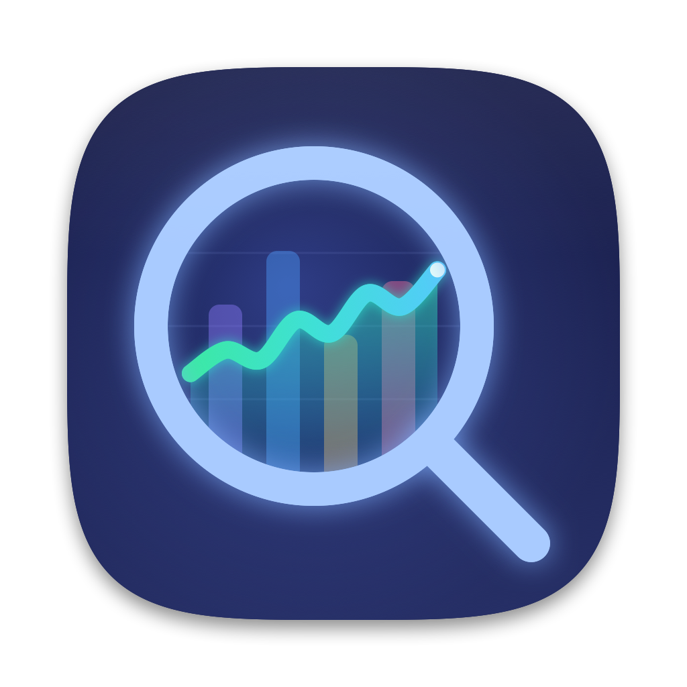
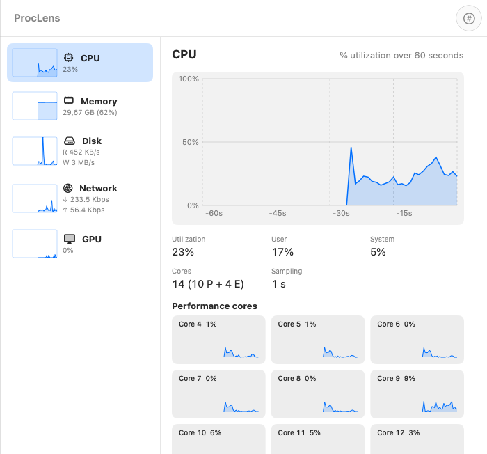

<div align="center">
  
  <h1>ProcLens</h1>
  <p><strong>A native, sysadmin-grade Task Manager for macOS.</strong><br/>
  Windows Task Manager's layout, Process Explorer's depth and a launchd manager — in one small Mac app.</p>

  <p>
    <a href="https://github.com/canberkys/proclens/releases/latest"></a>
    <a href="https://github.com/canberkys/proclens/releases"></a>
    
    
    
    
    
  </p>

  <p>
    <a href="#download">Download</a> ·
    <a href="#features">Features</a> ·
    <a href="#command-line-tool">CLI</a> ·
    <a href="#privileged-helper">Helper</a> ·
    <a href="#building-from-source">Build</a> ·
    <a href="docs/SPEC.md">Spec</a>
  </p>
</div>

---

ProcLens is for power users, sysadmins and developers who keep falling back to
`top`, `lsof`, `launchctl` and `ps`. It shows every process the way Windows Task
Manager does, lets you dig into any of them the way Process Explorer does, and
manages login items, launch agents and daemons — without leaving one window.

It reads everything through native APIs (libproc, sysctl, Mach host statistics,
IOKit, Security.framework) and **never shells out** to `ps`, `top` or `lsof` for
data. It is also light: with 1,000+ processes sampled every second it uses about
**0.5% CPU in the background**, around **1% with the window open**, and the
universal app is about **10 MB**.


## Download

Get the signed and notarized DMG from
**[Releases](https://github.com/canberkys/proclens/releases/latest)**, open it and
drag ProcLens to Applications. Requires macOS 14 Sonoma or later; runs natively on
Apple Silicon and Intel.

ProcLens updates itself with [Sparkle](https://sparkle-project.org): it checks at
most once a day (you can turn this off in **Settings → Updates**), and every update
is EdDSA-signed and notarized.

> ProcLens is distributed outside the Mac App Store on purpose: the App Sandbox
> does not allow an app to see other processes, which is the whole point of a
> task manager.

## Features

### Processes — Task Manager parity
- **Apps / Background / System** groups, with each app's helper processes nested under it.
- **CPU, Memory, Energy, Disk** columns with a Windows-style heat-map, plus totals in the header.
- **Search** by name, PID or path — typing an exact PID jumps to that process.
- **Ending tasks the Windows way:** right-click → *End task*, the <kbd>Delete</kbd> key,
  *Force quit*, *Suspend / Resume*, *End process tree*, and **End process by PID** (<kbd>⌘K</kbd>).
- Every destructive action is confirmed, and critical system processes (`kernel_task`,
  `launchd`, `WindowServer`, `loginwindow`, …) are refused with a clear message.

### Performance
- CPU total and **per-core grid with Performance and Efficiency cores** marked.
- Memory composition (app, wired, compressed, cached) and **memory pressure**.
- GPU utilization, disk read/write and network receive/send — all with 60-second graphs.

<p align="center">
  
</p>

### Details, process tree and Inspector
- PID, parent, user, architecture (Apple / Intel via Rosetta), threads, command line,
  start time and **code signature** (Apple, App Store, Developer ID, notarized, ad-hoc, unsigned).
- A **process tree** whose rows don't jump around while it updates.
- **Inspector** (<kbd>⌘I</kbd>) for any process: open files and sockets, loaded libraries,
  environment variables, certificate chain, hardened runtime and **entitlements**.

### Network Ports — find what's listening, and stop it
- Every listening TCP/UDP port with its owning process, address and a *localhost only* badge.
- **Dev-server detection** (Vite, Next.js, Astro, Python, Node, Rails, Postgres, Redis and more).
- **Open in browser**, and **End process tree** to stop a dev server together with every worker it spawned.


### Startup and Services
- Login items, LaunchAgents and LaunchDaemons, **grouped by the developer that signed them**.
- Enable / disable, start, restart and stop; view the plist. Apple's own items are hidden by default.
- Items in the system domain carry a lock and need the [helper](#privileged-helper).


### History and alerts
- The last hour of CPU, memory, disk, network and GPU — click any moment to see
  **which processes were on top at 14:32**.
- **Alert rules** such as *any process above 80% of a core for 60 s* → macOS notification.

### Menu bar
- A compact CPU indicator; click it for a **quick panel** with gauges, search, the top
  processes (end them right there) and the dev servers that are running.
- Global shortcut <kbd>⌃⌥⌘P</kbd> brings up the main window; the Dock icon can be hidden.


### Keyboard

| Shortcut | Action |
|---|---|
| <kbd>⌘1</kbd> … <kbd>⌘7</kbd> | Processes, Performance, Details, Network Ports, Startup, Services, History |
| <kbd>⌫</kbd> / <kbd>⌥⌫</kbd> | End task / Force quit the selection |
| <kbd>⌘K</kbd> | End process by PID |
| <kbd>⌘I</kbd> | Inspector for the selected process |
| <kbd>⌘?</kbd> | ProcLens Help |
| <kbd>⌃⌥⌘P</kbd> | Show ProcLens from anywhere (configurable) |

## Command-line tool

`proclens` shares the same engine and prints tables, JSON or CSV:

```bash
proclens ps --sort cpu --limit 10
proclens top --interval 2
proclens ports --json            # listening ports + dev-server classification
proclens kill 4242 --tree        # children first, SIGTERM then SIGKILL; refuses critical processes
proclens launchd --json
proclens system
```

Build it with `swift build -c release --package-path ProcLensCore --product proclens`.
Full reference: [docs/CLI.md](docs/CLI.md).

## Privileged helper

Most of ProcLens works without an administrator password. An **optional** helper,
installed from **Settings → Helper** and approved in System Settings → Login Items,
adds what needs root: statistics for root-owned processes, other users' processes and
system-domain launchd jobs.

It is registered with `SMAppService`, talks over XPC, accepts connections only from a
client signed with ProcLens' own identifier **and** Developer ID team, runs `launchctl`
with an argument allow-list (never a shell), and independently refuses to signal critical
system processes.

## Privacy

- No telemetry, no analytics, no accounts.
- The only network request is Sparkle's update check against the
  [appcast](appcast.xml) in this repository — at most once a day, and it can be turned off.

## How it works

| Layer | What |
|---|---|
| `ProcLensCore` | Swift package, no UI: actor-based collectors behind mockable source protocols, a deadline-based sampler, history, alerts, launchd and inspector code |
| `ProcLens` | SwiftUI app; large tables use `NSOutlineView` with diffed updates (no full reloads) |
| `ProcLensHelper` | Privileged XPC helper (`SMAppService.daemon`) |
| `proclens` | Command-line tool on the same core |

Design decisions are recorded in [DECISIONS.md](DECISIONS.md), and the scope in
[docs/SPEC.md](docs/SPEC.md).

## Building from source

Requirements: macOS 14+, Xcode 16+ (Swift 6), [XcodeGen](https://github.com/yonaskolb/XcodeGen).

```bash
git clone https://github.com/canberkys/proclens.git && cd proclens
xcodegen generate
xcodebuild -project ProcLens.xcodeproj -scheme ProcLens -configuration Release build
swift test --package-path ProcLensCore
```

Signed and notarized releases are produced by `scripts/release.sh`
(see [docs/RELEASING.md](docs/RELEASING.md)).

## Acknowledgements

ProcLens adapts code and data from MIT/BSD-licensed projects, notably
[exelban/stats](https://github.com/exelban/stats),
[Sean10000/LaunchManager](https://github.com/Sean10000/LaunchManager),
[tanRdev/lucid-task-manager](https://github.com/tanRdev/lucid-task-manager) and
[timdreesen/simple-dev-server-viewer](https://github.com/timdreesen/simple-dev-server-viewer).
License texts are in [THIRD_PARTY_NOTICES.md](THIRD_PARTY_NOTICES.md), and the reasoning
for each reuse is in [docs/REUSE_PLAN.md](docs/REUSE_PLAN.md).

## License

GNU General Public License v3.0 with additional terms under Section 7: no
misrepresentation of origin, modified versions must be renamed, and no trademark grant
for the ProcLens name or icon. See [LICENSE](LICENSE).

Copyright © 2026 Canberk Kılıçarslan.
